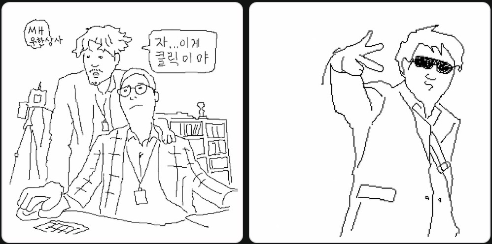
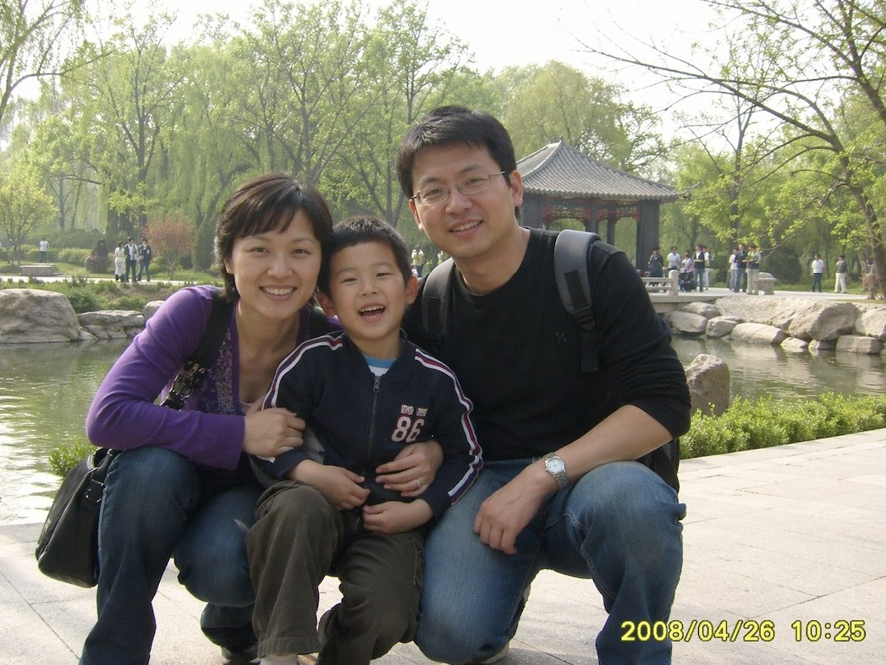
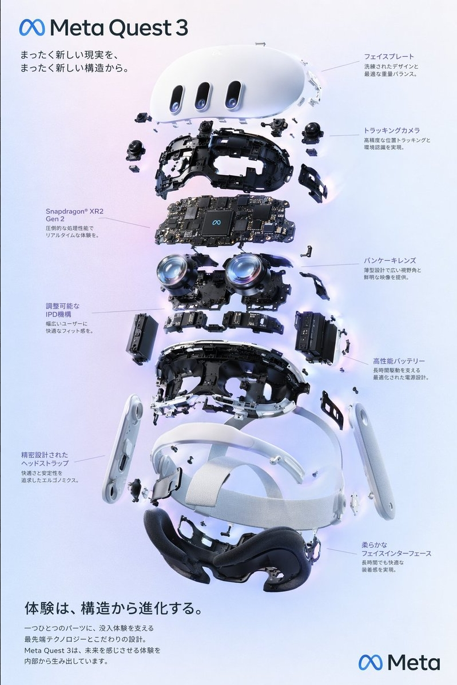
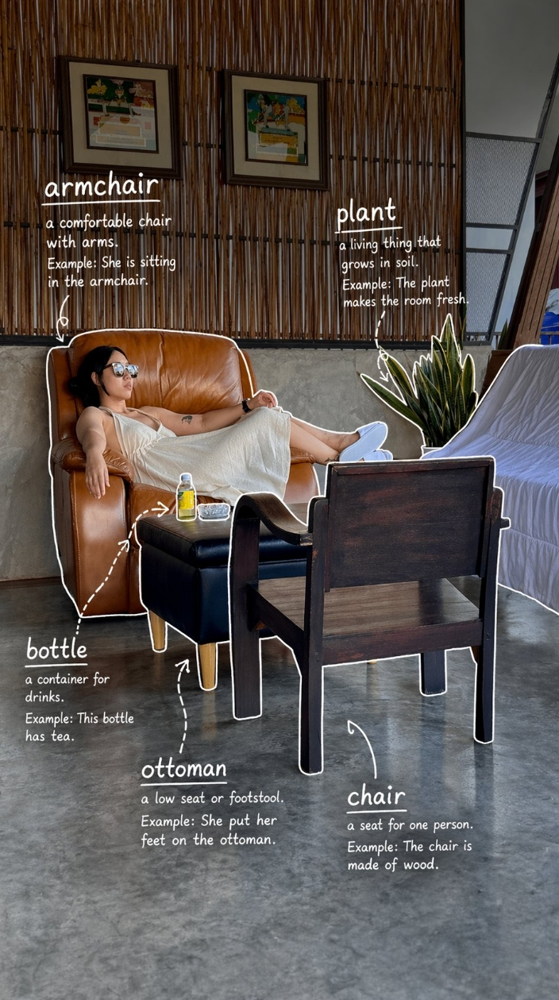
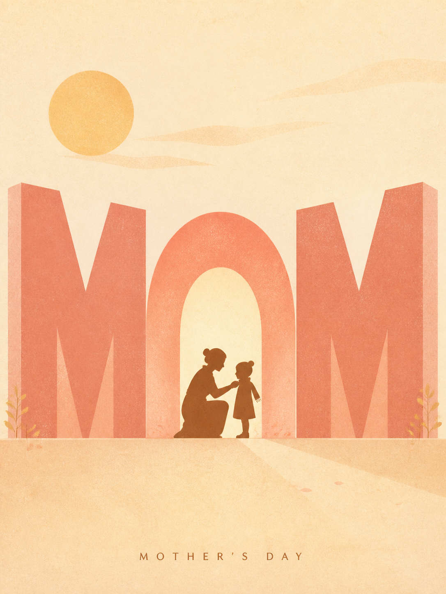
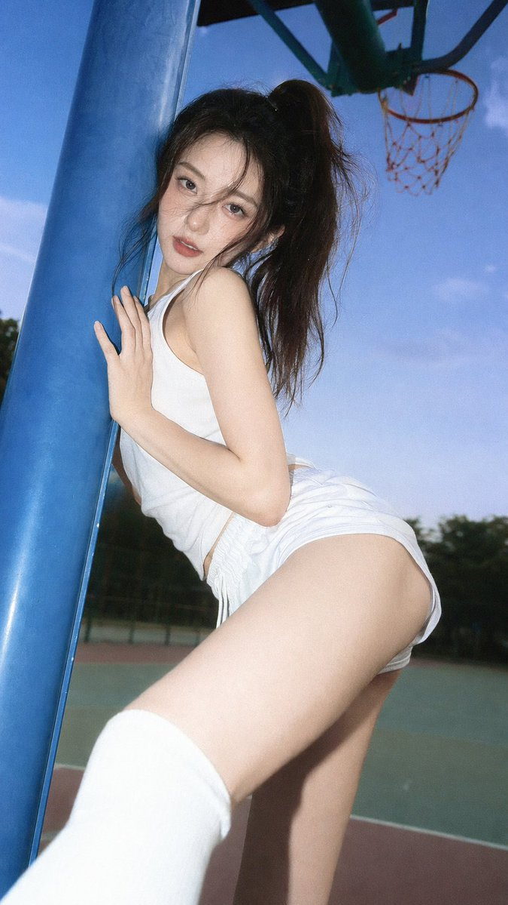
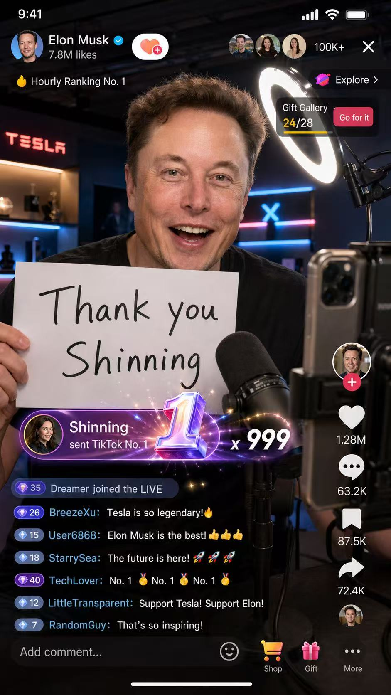
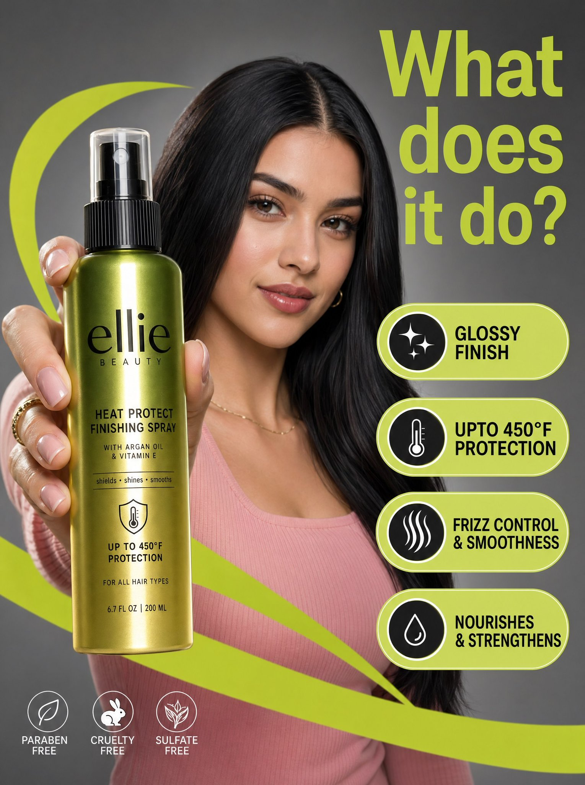
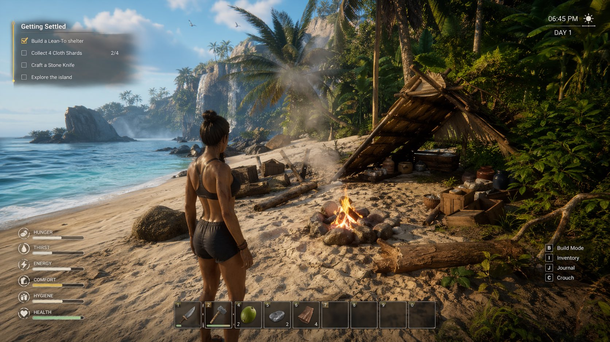

# GPT Image 2 Effects

> A curated collection of the most impressive GPT Image 2 effects, prompts, and visual experiments — sourced from X (Twitter) and the AI art community.

**167+ tested prompts** covering photography, poster design, character art, UI mockups, game art, and more.

🔗 **Full gallery with copy-paste prompts → [drawprompt.org/gpt-image-2-prompts](https://drawprompt.org/gpt-image-2-prompts)**

---

## Table of Contents

- [🔥 Latest & Trending](#-latest--trending)
- [📸 Photography & Portraits](#-photography--portraits)
- [🎨 Poster & Graphic Design](#-poster--graphic-design)
- [📱 UI / Mockups](#-ui--mockups)
- [🎮 Game Art](#-game-art)
- [✨ Creative & Experimental](#-creative--experimental)

---

## 🔥 Latest & Trending

### Pathetic Art — MS Paint Redraw Challenge
> Viral trend: attach any image and ask AI to redraw it as badly as possible



```
Redraw the attached image in the most clumsy, scribbly, and utterly pathetic way possible. Use a white background, and make it look like it was drawn in MS Paint with a mouse. It should be vaguely similar but also not really, kind of matching but also off in a confusing, awkward way, with that low-quality pixel-by-pixel feel that really emphasizes how ridiculously bad it is. Actually, you know what, whatever, just draw it however you want.
```

📸 Source: [neuronad.com](https://neuronad.com) · [Full prompt + breakdown →](https://drawprompt.org/prompts/pathetic-art-emotional-creature)

---

### 2008 Family Photo Recreation
> Hyper-detailed prompt recreating the exact aesthetic of early 2000s Chinese family photography



```
A candid family snapshot styled like a consumer digital camera photo from around 2008, showing a Chinese family of three posing closely together in a public park in springtime... Add a yellow digital camera timestamp in the bottom right corner reading 2008/04/26 10:25.
```

📸 Source: [@投机实验室 via appark.ai](https://x.com) · [Full prompt + breakdown →](https://drawprompt.org/prompts/2008-family-photo-recreation)

---

### VR Headset Exploded View — Product Poster
> Structured JSON prompt — GPT Image 2 interprets layout instructions directly



```json
{
  "type": "Product Exploded View Poster",
  "subject": "VR Headset",
  "style": "Clean high-tech 3D render, studio lighting, glowing accents",
  "background": "Soft purple-blue gradient",
  "layout": {
    "centerpiece": "Vertical stacked exploded view of a VR headset showing 9 different internal component layers",
    "callout_labels": { "count": 8 }
  }
}
```

📸 Source: [@WORY via appark.ai](https://x.com) · [Full prompt + breakdown →](https://drawprompt.org/prompts/vr-headset-exploded-view-technical)

---

### Turn Any Photo Into a Vocabulary Card
> Upload any photo — AI labels 5 objects with English words and hand-drawn annotations



```
[Task Goal] Identify 5 objects in the photo and add for each: 1. English word 2. Simple English definition 3. Optional short example sentence
[Drawing Style] Use white thin-line hand-drawn style annotations. Lines should look casually sketched, with a one-stroke feel.
[Overall Feel] Like hand-written English learning annotations on an everyday photo. Make the aspect ratio 9:16
```

📸 Source: [@林悦己Cheer via appark.ai](https://x.com) · [Full prompt + breakdown →](https://drawprompt.org/prompts/photo-to-vocabulary-card)

---

### Mother's Day MOM Silhouette Art Poster
> Flat graphic art print, monumental MOM typography as shelter, mother-child silhouette



```
Create a warm high-end flat graphic Mother's Day concept poster, aspect ratio 3:4.
Core text: MOM — visually translate "MOM" into shelter, protection, support, home, and quiet love.
The word "MOM" must become the main structural element of the poster.
Color palette: warm ivory, soft coral, dusty rose, muted peach — never dark blood red.
```

📸 Source: Community · [Full prompt + breakdown →](https://drawprompt.org/prompts/mothers-day-mom-silhouette-poster)

---

## 📸 Photography & Portraits

### Convenience Store Neon Portrait
> 35mm film photography, harsh fluorescent + neon lighting, cinematic street editorial style


```
35mm film photography with harsh convenience store fluorescent lighting mixed with colorful neon signs from outside, authentic film grain, high contrast, slight color cast, cinematic street editorial style, intimate medium shot...
```

📸 Source: [@BubbleBrain](https://x.com/BubbleBrain) · [Full prompt + breakdown →](https://drawprompt.org/prompts/convenience-store-neon-portrait)

---

### Cinematic Minimal Portrait
> Solitary figure in intense orange-red gradient, strong silhouette lighting, reflective floor


```
Generate a cinematic minimal portrait of a solitary man standing in an intense orange to red gradient environment, strong silhouette lighting, deep shadow contrast, reflective glossy floor, symmetrical composition, minimal
```

📸 Source: [@iam_miharbi](https://x.com/iam_miharbi) · [Full prompt + breakdown →](https://drawprompt.org/prompts/cinematic-minimal-portrait)

---

### 35mm Flash Editorial Portrait
> Harsh direct on-camera flash, high fashion basketball court editorial, authentic film grain



```
35mm color film photography with harsh direct on-camera flash, specular highlights on skin and clothing, strong catchlights in eyes, high contrast flash illumination, authentic film grain and color shift, high fashion fresh innocent basketball court editorial style...
```

📸 Source: [@BubbleBrain](https://x.com/BubbleBrain) · [Full prompt + breakdown →](https://drawprompt.org/prompts/35mm-flash-editorial-portrait)

---

### Sam Altman Bear Selfie
> Viral prompt — photorealistic celebrity selfie riding a bear, transparent background edit


```
generate image: Selfie of Sam Altman riding a bear

Edit prompt: Remove the background make it transparent
```

📸 Source: [@JustinGorya](https://x.com/JustinGorya) · [Full prompt + breakdown →](https://drawprompt.org/prompts/sam-altman-bear-selfie)

---

## 🎨 Poster & Graphic Design

### Surrealist Rolex Luxury Watch Fashion Poster
> High-fashion surrealist poster, deep emerald studio, monumental watch as centerpiece


```
A high-fashion surrealist poster for Rolex. A deep emerald green minimalist studio with a polished reflective floor. A massive Rolex watch stands upright like a monument. A male model in a tailored dark green suit leans casually against the watch face, wearing a matching Rolex.
```

📸 Source: [@Sheldon056](https://x.com/Sheldon056) · [Full prompt + breakdown →](https://drawprompt.org/prompts/surrealist-rolex-luxury-watch-fashion-poster)

---

### Silhouette Universe Narrative Poster
> Collector's edition narrative poster — a complete world growing inside a symbolic silhouette


```
Please generate a high-aesthetic "Silhouette Universe / Collector's Edition Narrative Poster" style artwork based on [Theme: xxx]. Do not limit the image to fixed objects or common containers. Let the AI choose the most symbolically powerful silhouette form...
```

📸 Source: [@MrLarus](https://x.com/MrLarus) · [Full prompt + breakdown →](https://drawprompt.org/prompts/silhouette-universe-narrative-poster)

---

## 📱 UI / Mockups

### Elon Musk TikTok Livestream Screenshot
> Photorealistic TikTok LIVE interface, celebrity holding a sign, gift notification UI



```
Create a 9:16 vertical, high-detail, photorealistic smartphone screenshot of a TikTok livestream. Elon Musk is speaking directly to the front-facing phone camera in a live broadcast room, looking excited, smiling, and warm, with a natural and authentic livestream atmosphere...
```

📸 Source: [@Shinning1010](https://x.com/Shinning1010) · [Full prompt + breakdown →](https://drawprompt.org/prompts/elon-musk-tiktok-livestream-screenshot)

---

### Beauty Product Commercial Marketing Photograph
> Studio commercial photo with graphic callouts, product in foreground, model behind



```
A high-resolution commercial marketing photograph features a young woman with sleek dark hair and a pink ribbed top in a neutral grey studio setting, centered behind a glossy Ellie Beauty spray bottle held prominently in the foreground. The composition is energized by vibrant, lime-green graphic "swooshes" and floating pill-shaped callouts...
```

📸 Source: [@AIwithSarah_](https://x.com/AIwithSarah_) · [Full prompt + breakdown →](https://drawprompt.org/prompts/beauty-product-commercial-marketing-photograph)

---

## 🎮 Game Art

### Rust In-Game Screenshot
> One of the most viral GPT Image 2 prompts — minimal input, stunning output


```
an ingame screenshot of rust
```

📸 Source: [@FixlationAI](https://x.com/FixlationAI) · [Full prompt + breakdown →](https://drawprompt.org/prompts/rust-in-game-screenshot)

---

### Counter-Strike x Terraria Screenshot Mashup
> Genre mashup — GPT Image 2 blends two completely different game aesthetics


```
counter strike in game screenshot, mixed with Terraria
```

📸 Source: Community · [Full prompt + breakdown →](https://drawprompt.org/prompts/counter-strike-x-terraria-screenshot-mashup)

---

### AAA Video Game Screenshot Concept
> Imagining what a Sims Castaways sequel could look like in 2026



```
generate screenshots from a AAA video game based off what The Sims Castaways sequel could look like.
```

📸 Source: Community · [Full prompt + breakdown →](https://drawprompt.org/prompts/aaa-video-game-screenshot-concept-design)

---

## ✨ Creative & Experimental

### Lion Camel Ridge — Dark Myth Scene
> Chinese dark mythology aesthetic, Journey to the West, epic low-angle battle scene


```
Chinese weird style, dark mysterious aesthetic fused with Chinese aesthetics, perfect details, multi-pass rendering, perfect modeling. Journey to the West setting, Lion Camel Ridge, thousands of demons and monsters. Seated on the giant throne on the left is the Elephant King heavy-armored demon...
```

📸 Source: [@MANISH1027512](https://x.com/MANISH1027512) · [Full prompt + breakdown →](https://drawprompt.org/prompts/lion-camel-ridge-dark-myth-scene)

---

## Why GPT Image 2?

GPT Image 2 (released April 2026) is OpenAI's most capable image generation model. Key strengths:

- **Near-perfect text rendering** — typography in images is finally reliable
- **Instruction following** — complex multi-part prompts work as intended
- **Photo editing** — upload an image and transform it with natural language
- **JSON prompts** — structured layout instructions work directly
- **Consistent style** — maintains visual coherence across complex scenes

---

## Browse All 167+ Effects

This repo covers a curated selection. The full library with copy-paste prompts, example images, and structured breakdowns is at:

**→ [drawprompt.org/gpt-image-2-prompts](https://drawprompt.org/gpt-image-2-prompts)**

Categories: Photography · Photo Editing · Character Design · UI/UX · Poster · Infographic · Film · Game · Product

---

## Contributing

Found a great GPT Image 2 effect on X or Reddit? Open a PR or issue with:

1. The full prompt
2. An example image (or link to the original post)
3. The source (X/Twitter handle or Reddit post)

Please only submit prompts sourced from **social media** (X, Reddit, Instagram, etc.) — not from other GitHub repositories.

---

## License

MIT — prompts are free to use, remix, and share.
